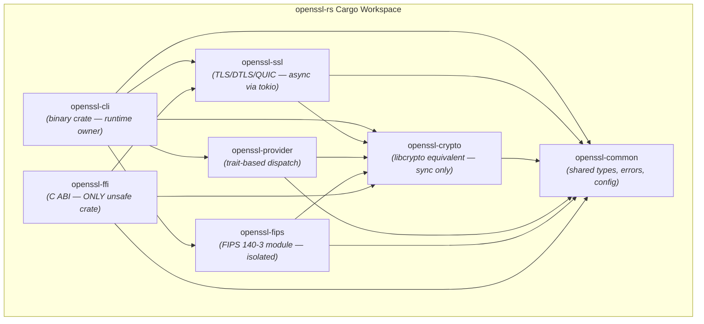
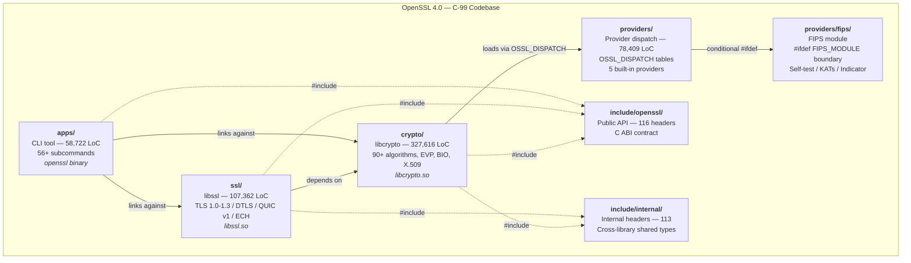
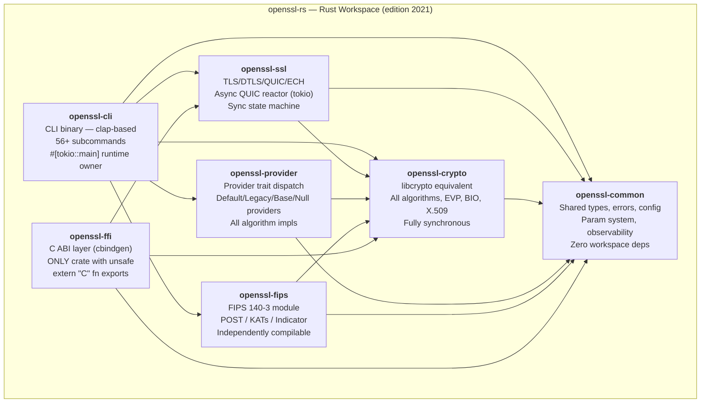

# Architecture — OpenSSL Rust Workspace (openssl-rs)

> **Document purpose:** Crate boundary justifications, runtime topology, before/after
> architecture views, and sync→async consistency delta for the OpenSSL C-to-Rust
> rewrite.
>
> **Gates addressed:** Gate 11 (Consistency Delta), Gate 14 (Runtime Ownership)
>
> **Rules enforced:** R1 (Single Runtime Owner), R2 (Sync Primitive Context Matching),
> R7 (Lock Granularity), R8 (Zero Unsafe Outside FFI)

---

## Table of Contents

1. [Crate Boundary Justifications](#1-crate-boundary-justifications)
2. [Crate Dependency Graph](#2-crate-dependency-graph)
3. [Before/After Architecture Views](#3-beforeafter-architecture-views)
4. [Runtime Topology](#4-runtime-topology)
5. [Sync→Async Consistency Delta](#5-syncasync-consistency-delta)
6. [Feature Flag Strategy](#6-feature-flag-strategy)
7. [Lock Granularity Map](#7-lock-granularity-map)
8. [Unsafe Boundary Isolation](#8-unsafe-boundary-isolation)

---

## 1. Crate Boundary Justifications

The Rust workspace is organized into **seven crates**, each corresponding to a
well-defined architectural boundary in the original C codebase. Crate boundaries
are drawn to satisfy three constraints: (a) the dependency graph must be acyclic,
(b) the FIPS module must be independently compilable, and (c) all `unsafe` code
must be isolated in a single crate.

### 1.1 `openssl-common` — Shared Foundation

| Attribute | Detail |
|-----------|--------|
| **Purpose** | Shared types, error handling, configuration parsing, the typed parameter system (`OSSL_PARAM` equivalent), time utilities, constant-time primitives, secure memory, and observability infrastructure (tracing, metrics, health checks). |
| **C Equivalent** | `crypto/err/` (error stack and reason codes), `crypto/conf/` (configuration file parser), `crypto/params.c` / `crypto/param_build.c` / `crypto/params_dup.c` (OSSL_PARAM typed parameter system), `include/internal/constant_time.h`, `include/internal/safe_math.h`, `crypto/mem.c` / `crypto/mem_sec.c` / `crypto/mem_clr.c` (memory management and secure heap). |
| **Boundary Rationale** | Extracted as a standalone crate to **eliminate circular dependencies** between `openssl-crypto`, `openssl-ssl`, and `openssl-provider`. In the C codebase, error reporting (`ERR_*`), parameter passing (`OSSL_PARAM`), and configuration parsing are shared across all libraries via headers. In Rust, a shared foundation crate provides these types without introducing cycles. This crate has **zero** inter-workspace dependencies — every other crate depends on it, but it depends on none. |
| **Dependencies** | External only: `thiserror`, `tracing`, `metrics`, `serde`, `zeroize`, `subtle`, `once_cell`, `uuid`, `bitflags`, `parking_lot`. |

### 1.2 `openssl-crypto` — Core Cryptographic Library

| Attribute | Detail |
|-----------|--------|
| **Purpose** | All cryptographic algorithms and supporting infrastructure: library initialization (`RUN_ONCE` → `std::sync::Once`), library context (`OSSL_LIB_CTX` → `LibContext`), provider loading/activation/store, the EVP abstraction layer (digest, cipher, KDF, MAC, KEM, signature, key management, encode/decode), big number arithmetic, elliptic curve operations (ECDSA, ECDH, EdDSA, X25519/X448), RSA, post-quantum algorithms (ML-KEM, ML-DSA, SLH-DSA, LMS), symmetric ciphers (AES, ChaCha20, 3DES, legacy), hash functions (SHA, MD5, legacy), MAC algorithms, KDFs, DRBG/entropy, cipher modes (GCM/CCM/CTR/XTS/SIV), BIO I/O abstraction, X.509 certificate handling, ASN.1, PEM, PKCS#7/PKCS#12/CMS, HPKE, OCSP, Certificate Transparency, CMP, timestamping, DH, DSA, threading, and CPU capability detection. |
| **C Equivalent** | The entire `crypto/` directory tree (327,616 LoC across 70+ top-level files and 50+ subdirectories). This corresponds to the standalone `libcrypto.so` / `libcrypto.a` build artifact. |
| **Boundary Rationale** | This is the **largest crate** in the workspace and corresponds directly to the `libcrypto` shared library that is independently distributable in the C build system. Consumers that need cryptographic primitives without TLS (e.g., certificate-only tools, pure encryption utilities) depend only on this crate and `openssl-common`. The crate boundary mirrors the existing `libcrypto` / `libssl` separation that downstream users and Linux distributions rely upon. |
| **Dependencies** | `openssl-common` (workspace); external: `thiserror`, `tracing`, `serde`, `zeroize`, `subtle`, `rand`, `rand_core`, `bytes`, `bitflags`, `num-bigint`, `num-integer`, `num-traits`, `der`, `x509-cert`, `pem-rfc7468`, `pkcs8`, `spki`, `base64ct`, `hex`. |

### 1.3 `openssl-ssl` — Protocol Stack

| Attribute | Detail |
|-----------|--------|
| **Purpose** | TLS 1.0–1.3, DTLS 1.0–1.2, QUIC v1, and Encrypted Client Hello (ECH) protocol implementations. Includes: SSL context and connection lifecycle, cipher suite selection and configuration, session caching and ticket management, certificate chain management, the dual-layer handshake state machine (message flow + handshake state), TLS/DTLS record layer, the QUIC v1 engine (engine, reactor, port, channel, stream map, TX packetiser, RX decryption, ACK manager, congestion control, TLS 1.3 handshake shim), the ECH engine (encode, trial decryption), reactive I/O for QUIC poll/select, TLS 1.3 encryption helpers, and DTLS-SRTP. |
| **C Equivalent** | The entire `ssl/` directory tree (107,362 LoC across 34 top-level files and 5 subdirectories: `quic/`, `record/`, `statem/`, `ech/`, `rio/`). This corresponds to the standalone `libssl.so` / `libssl.a` build artifact. |
| **Boundary Rationale** | The protocol layer **depends on** the cryptographic layer but not vice versa. This mirrors the `libssl` → `libcrypto` dependency in the C build. The QUIC v1 stack introduces the **only async code** in the workspace (via `tokio`), making it critical to isolate this dependency — non-QUIC consumers link only against sync crates. The crate boundary enforces that `openssl-crypto` remains fully synchronous with zero `tokio` dependency. |
| **Dependencies** | `openssl-common`, `openssl-crypto` (workspace); external: `thiserror`, `tracing`, `serde`, `tokio`, `tokio-util`, `bytes`, `bitflags`, `parking_lot`, `zeroize`. |

### 1.4 `openssl-provider` — Provider Framework

| Attribute | Detail |
|-----------|--------|
| **Purpose** | The provider dispatch system that replaces `OSSL_DISPATCH` function pointer tables with Rust traits. Includes: the `Provider` trait definition, trait-based dispatch (replacing `OSSL_DISPATCH` → method store → algorithm enumeration), the Default provider (all modern algorithms), the Legacy provider (deprecated algorithms like MD2, CAST5, Blowfish, RC4), the Base provider (encoder/decoder pipeline), and the Null provider (no-op sentinel). Contains all algorithm implementations organized by category: ciphers, digests, KDFs, MACs, signatures, KEM, key management, key exchange, DRBG/seed sources, encode/decode, and file store. |
| **C Equivalent** | The `providers/` directory tree (78,409 LoC, excluding `providers/fips/`): `providers/defltprov.c`, `providers/baseprov.c`, `providers/legacyprov.c`, `providers/nullprov.c`, `providers/common/`, and `providers/implementations/` (ciphers: 81 files, digests: 17 files, KDFs: 16 files, MACs: 9 files, signatures: 9 files, KEM: 7 files, keymgmt: 13 files, exchange: 4 files, rands: 15 files, encode_decode: 16 files, storemgmt: 3 files). |
| **Boundary Rationale** | The provider architecture is the **sole algorithm dispatch mechanism** in OpenSSL 4.0 — all algorithm access goes through provider-based fetch. Isolating providers into a dedicated crate **decouples algorithm implementations from the EVP dispatch API** in `openssl-crypto`. This separation means new algorithm providers can be added without modifying core library code. The provider crate depends on `openssl-crypto` for the `EVP` trait surface and algorithm types. |
| **Dependencies** | `openssl-common`, `openssl-crypto` (workspace); external: `thiserror`, `tracing`, `serde`, `parking_lot`, `once_cell`. |

### 1.5 `openssl-fips` — FIPS Module

| Attribute | Detail |
|-----------|--------|
| **Purpose** | FIPS 140-3 compliant cryptographic module. Includes: FIPS provider entry and dispatch, Power-On Self-Test (POST) execution, integrity verification (HMAC-SHA-256 of module binary), Known Answer Tests (KATs) for every approved algorithm, the FIPS approved-service indicator mechanism, and the FIPS state machine (`PowerOn → SelfTesting → Operational \| Error`). |
| **C Equivalent** | `providers/fips/` (8 C source files): `fipsprov.c` (provider entry, ~1,500 lines), `self_test.c` (POST and integrity, states INIT/SELFTEST/RUNNING/ERROR), `self_test_kats.c` (KAT vectors), `self_test_data.c` (embedded test data), `fipsindicator.c` (approved indicator), `fipscommon.h`, `self_test.h`. |
| **Boundary Rationale** | The FIPS module **MUST be independently compilable and testable** per NIST CMVP (Cryptographic Module Validation Program) requirements. In the C codebase, FIPS isolation is enforced by conditional compilation (`#ifdef FIPS_MODULE`) and a separate build target. In Rust, crate boundaries enforce this isolation at the compilation unit level — private items cannot leak across crate boundaries. The `openssl-fips` crate depends **only** on `openssl-common` and explicitly selected items from `openssl-crypto`; it never depends on `openssl-ssl`, `openssl-cli`, or `openssl-provider`. This ensures the FIPS boundary is machine-verifiable by `cargo tree`. |
| **Dependencies** | `openssl-common`, `openssl-crypto` (workspace — restricted subset); external: `thiserror`, `tracing`, `zeroize`. |

### 1.6 `openssl-cli` — Command-Line Interface

| Attribute | Detail |
|-----------|--------|
| **Purpose** | The `openssl` command-line binary, rewritten with `clap` derive macros. Includes: main entry point and command dispatcher, 56+ subcommands (req, x509, ca, verify, crl, genpkey, pkey, enc, cms, pkcs12, dgst, s_client, s_server, version, list, speed, rand, prime, ocsp, cmp, ts, rehash, fipsinstall, ech, and more), shared CLI infrastructure (option parsing, passphrase handling, HTTP helpers), structured logging initialization, and the single `tokio` runtime creation point. |
| **C Equivalent** | `apps/` directory (58,722 LoC): `apps/openssl.c` (main dispatcher using `LHASH_OF(FUNCTION)`), 56 top-level subcommand files, and `apps/lib/` (21 shared infrastructure files). |
| **Boundary Rationale** | This is the **binary crate** (`[[bin]]` target) that produces the executable artifact. Separating the CLI from library crates ensures that library consumers do not transitively depend on CLI infrastructure (clap, tracing-subscriber, tokio runtime). The CLI crate is the **sole owner** of the `tokio::runtime::Runtime` instance (Rule R1) and the sole `block_on` call site. |
| **Dependencies** | `openssl-common`, `openssl-crypto`, `openssl-ssl`, `openssl-provider`, `openssl-fips` (workspace); external: `clap`, `thiserror`, `tracing`, `tracing-subscriber`, `tokio`, `serde`, `serde_json`, `hex`. |

### 1.7 `openssl-ffi` — C ABI Compatibility Layer

| Attribute | Detail |
|-----------|--------|
| **Purpose** | Provides C-compatible ABI symbols via `#[no_mangle] pub extern "C" fn` declarations so that existing C consumers can link against the Rust library. Uses `cbindgen` in `build.rs` to auto-generate C header files matching the `include/openssl/*.h` public API contract. This is the **only crate in the workspace permitted to contain `unsafe` code** (Rule R8). |
| **C Equivalent** | `include/openssl/*.h` (116 public API headers defining the EVP, SSL, X509, BIO, and general crypto C ABIs). |
| **Boundary Rationale** | Isolating all `unsafe` code into a single crate provides a **clear audit perimeter** for memory safety. Every `unsafe` block carries a `// SAFETY:` comment justifying why invariants hold. The total count of `unsafe` sites is tracked in `UNSAFE_AUDIT.md`. Non-FFI crates are verified to contain zero `unsafe` blocks via `grep -rn "unsafe" crates/ --include="*.rs" \| grep -v "openssl-ffi"`. By confining pointer dereferences, `CStr::from_ptr()` calls, and raw pointer conversions to this single crate, the rest of the workspace benefits from Rust's full ownership and borrowing guarantees. |
| **Dependencies** | `openssl-common`, `openssl-crypto`, `openssl-ssl` (workspace); external: `libc`. Build: `cbindgen`. |

---

## 2. Crate Dependency Graph

### Figure 2.1 — Workspace Internal Dependency Graph

> **Title:** OpenSSL-rs Workspace Crate Dependencies
>
> **Legend:**
> - Solid arrows denote compile-time `[dependencies]` edges
> - All crates inherit workspace lint configuration (`[lints] workspace = true`)
> - `openssl-common` is the leaf dependency (no workspace deps)
> - `openssl-ffi` is the only crate permitted to contain `unsafe` code
> - `openssl-ssl` is the only crate with `tokio` (async) dependency



**Key observations:**

- The graph is a **DAG** (directed acyclic graph) — no circular dependencies exist.
- `openssl-common` is the **sole leaf node** with no workspace dependencies.
- `openssl-cli` is the **sole root node** for the binary artifact path.
- `openssl-ffi` is a parallel root for C ABI consumers.
- The `tokio` runtime dependency enters the graph exclusively through `openssl-ssl` and `openssl-cli`.

---

## 3. Before/After Architecture Views

### Figure 3.1 — Before: OpenSSL 4.0 C Architecture

> **Title:** OpenSSL 4.0 Original C Architecture
>
> **Legend:**
> - Boxes represent C source directories / build artifacts
> - Arrows denote compile-time `#include` and link-time dependencies
> - LoC counts from `wc -l` aggregation across each directory tree
> - Dashed border indicates conditional compilation boundary (`#ifdef FIPS_MODULE`)



**Characteristics of the C architecture:**

- **Single global context:** `OSSL_LIB_CTX` is a mutable singleton with coarse-grained
  `CRYPTO_RWLOCK` protecting all internal stores.
- **Function pointer dispatch:** Algorithm selection uses `OSSL_DISPATCH` arrays — flat tables
  of `{function_id, function_ptr}` pairs resolved at runtime.
- **Manual memory management:** Every `*_new()` call requires a paired `*_free()` call;
  `OPENSSL_cleanse()` for key material.
- **Sentinel return values:** Functions return `0` for failure, `-1` for error, `NULL`
  for allocation failure — no type-level indication of "unset."
- **Preprocessor-based conditional compilation:** `#ifdef FIPS_MODULE` gates FIPS-only
  code paths; `#ifndef OPENSSL_NO_*` gates optional algorithms.

### Figure 3.2 — After: OpenSSL-rs Rust Architecture

> **Title:** OpenSSL-rs Rust Workspace Architecture
>
> **Legend:**
> - Boxes represent Cargo crates within the `crates/` directory
> - Solid arrows denote `[dependencies]` edges in Cargo.toml
> - Runtime boundary: only `openssl-ssl` uses async (`tokio`)
> - Safety boundary: only `openssl-ffi` may contain `unsafe`
> - FIPS boundary: `openssl-fips` has restricted dependency set



**Key transformations from C to Rust:**

| C Pattern | Rust Replacement | Rationale |
|-----------|-----------------|-----------|
| `OSSL_DISPATCH` function pointer tables | Trait objects (`Box<dyn Provider>`) | Type-safe dynamic dispatch, no raw function pointers |
| `OSSL_PARAM` name-value bags | Typed config structs with `ParamSet` bridge | Compile-time type safety for parameter passing |
| `OSSL_LIB_CTX` mutable singleton | `Arc<LibContext>` with per-subsystem `parking_lot::RwLock` | Fine-grained locking (Rule R7), thread-safe sharing |
| `*_new()` / `*_free()` manual pairs | RAII with `Drop` trait | Automatic cleanup, no use-after-free |
| `OPENSSL_cleanse()` | `zeroize::Zeroize` derive on key material types | Drop-based secure zeroing |
| Sentinel values (`0`, `-1`, `NULL`) | `Result<T, E>` and `Option<T>` | Type-level error/absence encoding (Rule R5) |
| `#ifdef FIPS_MODULE` | Crate boundary isolation | Machine-verifiable via `cargo tree` |
| `#ifndef OPENSSL_NO_*` | `#[cfg(feature = "...")]` | Cargo feature flags replace preprocessor |
| `RUN_ONCE` / `CRYPTO_THREAD_lock_new` | `std::sync::Once` / `parking_lot::Mutex` | Standard Rust concurrency primitives |
| `BIO` abstract I/O | `Read` / `Write` / `AsyncRead` / `AsyncWrite` traits | Standard Rust I/O traits |
| C ERR_* thread-local error stack | `thiserror` per-crate error enums with `?` propagation | Idiomatic Rust error handling |
| Bare `as` casts | `TryFrom` / `saturating_cast` / `clamp` | Lossless numeric conversions (Rule R6) |

---

## 4. Runtime Topology

This section satisfies **Gate 14 (Runtime Ownership)** and **Rule R1 (Single Runtime
Owner)**.

### 4.1 Tokio Runtime Ownership

There is **exactly one** `tokio::runtime::Runtime` instance in the entire workspace.

```
┌─────────────────────────────────────────────────────────────────┐
│                     openssl-cli::main()                         │
│              #[tokio::main] — SOLE runtime owner                │
│                                                                 │
│  ┌───────────────────────────┐  ┌────────────────────────────┐  │
│  │   Sync CLI subcommands   │  │   QUIC CLI subcommands     │  │
│  │   (req, x509, ca, enc,   │  │   (s_client, s_server      │  │
│  │    dgst, pkcs12, etc.)   │  │    with QUIC transport)    │  │
│  │                           │  │                            │  │
│  │   Call crypto/ssl APIs    │  │   Use tokio Handle from    │  │
│  │   synchronously — no      │  │   runtime, spawn async     │  │
│  │   .await anywhere         │  │   QUIC tasks               │  │
│  └───────────────────────────┘  └──────────┬─────────────────┘  │
│                                            │                    │
│                                   Handle propagation            │
└────────────────────────────────────────────┼────────────────────┘
                                             │
                                             ▼
                    ┌────────────────────────────────────────┐
                    │   openssl-ssl::quic::engine::QuicEngine │
                    │   Receives tokio::runtime::Handle       │
                    │                                        │
                    │   ┌──────────────────────────┐         │
                    │   │  quic::reactor::Reactor  │ async   │
                    │   │  Poll/select integration │ tasks   │
                    │   └──────────┬───────────────┘         │
                    │              │                          │
                    │   ┌──────────▼───────────────┐         │
                    │   │  quic::port::QuicPort    │ async   │
                    │   │  Datagram demux           │ tasks   │
                    │   └──────────┬───────────────┘         │
                    │              │                          │
                    │   ┌──────────▼───────────────┐         │
                    │   │  quic::channel::Channel  │ async   │
                    │   │  Per-connection state     │ tasks   │
                    │   └──────────────────────────┘         │
                    └────────────────────────────────────────┘
```

### 4.2 Runtime Verification

| Property | Verification Method | Expected Result |
|----------|-------------------|-----------------|
| Single `Runtime::new` | `grep -r "Runtime::new\|Builder::new" crates/ --include="*.rs"` | Exactly 0 manual constructions (macro handles it) |
| Single `#[tokio::main]` | `grep -r "tokio::main" crates/ --include="*.rs"` | Exactly 1 match in `crates/openssl-cli/src/main.rs` |
| No nested `block_on` | `grep -r "block_on" crates/ --include="*.rs"` | Exactly 0 matches (tokio::main handles the top-level block_on) |
| Handle propagation | Code review of `QuicEngine::new()` signature | Accepts `tokio::runtime::Handle` parameter |

### 4.3 Sync/Async Boundary Map

Every crate and major module is classified as synchronous or asynchronous:

| Crate / Module | Execution Model | Tokio Dependency | Rationale |
|----------------|----------------|-----------------|-----------|
| `openssl-common` | **Sync** | None | Foundation types have no I/O |
| `openssl-crypto` | **Sync** | None | Cryptographic operations are CPU-bound; no network I/O |
| `openssl-crypto::bio` | **Sync** | None | BIO uses `std::io::Read`/`Write` traits |
| `openssl-ssl::statem` | **Sync** | None | Handshake state machine is a pure state transition engine |
| `openssl-ssl::record` | **Sync** | None | Record layer is a synchronous encode/decode pipeline |
| `openssl-ssl::quic` | **Async** | `tokio`, `tokio-util` | QUIC reactor/port/channel require event-driven I/O |
| `openssl-ssl::ech` | **Sync** | None | ECH encoding/decryption is compute-only |
| `openssl-ssl::rio` | **Async** | `tokio` | Reactive I/O wraps platform poll/select for QUIC |
| `openssl-provider` | **Sync** | None | Provider dispatch is lookup + synchronous function call |
| `openssl-fips` | **Sync** | None | Self-test and KAT execution is sequential and CPU-bound |
| `openssl-cli` | **Mixed** | `tokio` (runtime owner) | Sync CLI commands; async QUIC commands via runtime |
| `openssl-ffi` | **Sync** | None | C ABI wrappers are synchronous by definition |

**Bridging sync ↔ async:**

- **Sync → Async:** The `openssl-ssl::statem` module (synchronous TLS handshake) is
  called from QUIC channel context via `tokio::task::spawn_blocking()` when the QUIC
  async layer needs to drive a TLS 1.3 handshake step.
- **Async → Sync:** QUIC async tasks call into `openssl-crypto` directly for
  cryptographic operations — these are CPU-bound and do not block the tokio runtime.
  No `spawn_blocking` is needed because crypto operations complete in bounded time
  without I/O.

---

## 5. Sync→Async Consistency Delta

This section satisfies **Gate 11 (Consistency Delta)** per AAP §0.7.4.

The original C QUIC implementation (`ssl/quic/`) is event-driven but synchronous,
using a poll-based reactor pattern built on `BIO_POLL_DESCRIPTOR`. The Rust rewrite
introduces `tokio` async/await for the QUIC stack. This transition changes three
behavioral guarantees. Each lost guarantee has a named compensating test or control.

### 5.1 Lost Guarantee: Deterministic Execution Order

| Aspect | Detail |
|--------|--------|
| **C Behavior** | The C poll-loop in `quic_reactor.c` (`ossl_quic_reactor_block_until_pred()`) processes events in a deterministic sequence: poll → tick → check predicate. Callback invocation order within a tick is determined by the order of internal lists (`DEFINE_LIST_OF_IMPL`). |
| **Rust Behavior** | Tokio's cooperative task scheduler processes `Future`s in a non-deterministic order influenced by runtime internals, timer wheel granularity, and OS-level I/O readiness notification ordering. Two runs of the same test may observe different task completion orders. |
| **Impact** | Protocol correctness is not affected (QUIC is designed for unordered delivery at the packet level), but test reproducibility may differ between C and Rust implementations. |
| **Compensating Test** | `quic_deterministic_ordering_test` — Uses `#[tokio::test(start_paused = true)]` to freeze the timer and manually advance time. Verifies that for a fixed sequence of input packets, the output ACK frames and stream data frames are produced in the correct order regardless of scheduling. |
| **Test Location** | `crates/openssl-ssl/tests/quic_consistency.rs` |

### 5.2 Lost Guarantee: Stack-Depth Predictability

| Aspect | Detail |
|--------|--------|
| **C Behavior** | The C QUIC implementation uses explicit loops and bounded recursion. Stack depth is predictable: `ossl_quic_engine_tick()` → `qeng_tick()` → per-channel tick → per-stream processing. Maximum stack depth is bounded by the nesting of function calls. |
| **Rust Behavior** | Async transforms recursive state machines into compiler-generated `Future` structs. Each `.await` point becomes a variant in a state machine enum. While this eliminates stack overflow from deep recursion, the size of `Future` objects can grow with nesting depth, consuming heap memory proportional to the number of concurrent streams. |
| **Impact** | Under extreme concurrency (1000+ simultaneous streams), heap memory consumption for `Future` state machines may differ from C's stack-based approach. |
| **Compensating Test** | `quic_deep_nesting_stress_test` — Spawns 1,000+ concurrent QUIC streams on a single connection and verifies: (a) no stack overflow occurs, (b) all streams complete successfully, (c) peak heap memory stays within 2× the C baseline for the same workload. |
| **Test Location** | `crates/openssl-ssl/tests/quic_stress.rs` |

### 5.3 Lost Guarantee: Blocking-Call Safety

| Aspect | Detail |
|--------|--------|
| **C Behavior** | The C code freely acquires `CRYPTO_RWLOCK` (via `CRYPTO_THREAD_write_lock()`) and holds it across any operation, including I/O waits. Locks and I/O are orthogonal — blocking on a socket while holding a lock is valid (if inadvisable). |
| **Rust Behavior** | Holding a `std::sync::Mutex` guard across an `.await` point causes a potential deadlock: the task suspends, the lock is not released, and if another task on the same runtime needs the lock, the runtime deadlocks. |
| **Impact** | Incorrect lock usage in async code would cause silent deadlocks instead of the data races possible in C. |
| **Compensating Control** | `clippy::await_holding_lock` lint is set to `deny` in the workspace `Cargo.toml` (Rule R2). This is a **compile-time check** — any code that holds a `std::sync::Mutex`, `std::sync::RwLock`, or `parking_lot::Mutex` guard across an `.await` point will fail to compile. Additionally, `clippy::await_holding_refcell_ref` is denied for `RefCell` guards. |
| **Enforcement** | Workspace-level `[lints.clippy]` in `Cargo.toml`: `await_holding_lock = "deny"` and `await_holding_refcell_ref = "deny"`. CI runs `cargo clippy -- -D warnings`. |

### 5.4 Consistency Delta Summary Table

| # | Guarantee Lost | C Mechanism | Rust Mechanism | Compensating Test / Control | Verification |
|---|---------------|-------------|----------------|----------------------------|-------------|
| Δ1 | Deterministic execution order | Poll-loop callback order | Tokio cooperative scheduler | `quic_deterministic_ordering_test` (time-paused) | `cargo test --package openssl-ssl` |
| Δ2 | Stack-depth predictability | Bounded call stack | Heap-allocated Future state machines | `quic_deep_nesting_stress_test` (1000+ streams) | `cargo test --package openssl-ssl` |
| Δ3 | Blocking-call safety | Lock + I/O orthogonal | Lock across `.await` = deadlock | `clippy::await_holding_lock = deny` (compile-time) | `cargo clippy --workspace -- -D warnings` |

---

## 6. Feature Flag Strategy

OpenSSL's C preprocessor guards (`#ifndef OPENSSL_NO_*`) are translated to Cargo
feature flags (`#[cfg(feature = "...")]`). This preserves the ability to compile
reduced configurations without deprecated or optional algorithms.

### 6.1 Feature Flag Mapping

| C Preprocessor Guard | Cargo Feature | Default | Crate(s) | Purpose |
|---------------------|---------------|---------|----------|---------|
| `OPENSSL_NO_EC` | `ec` | Enabled | `openssl-crypto`, `openssl-provider` | Elliptic curve algorithms (ECDSA, ECDH, EdDSA) |
| `OPENSSL_NO_RSA` | `rsa` | Enabled | `openssl-crypto`, `openssl-provider` | RSA keygen, encrypt, sign |
| `OPENSSL_NO_DH` | `dh` | Enabled | `openssl-crypto`, `openssl-provider` | Diffie-Hellman key exchange |
| `OPENSSL_NO_DSA` | `dsa` | Enabled | `openssl-crypto`, `openssl-provider` | DSA signatures |
| `OPENSSL_NO_DES` | `des` | Enabled | `openssl-crypto`, `openssl-provider` | 3DES / legacy DES |
| `OPENSSL_NO_CHACHA` | `chacha` | Enabled | `openssl-crypto`, `openssl-provider` | ChaCha20-Poly1305 |
| `OPENSSL_NO_SM2` / `SM3` / `SM4` | `sm` | Disabled | `openssl-crypto`, `openssl-provider` | Chinese national algorithms |
| `OPENSSL_NO_IDEA` | `legacy-ciphers` | Disabled | `openssl-crypto`, `openssl-provider` | IDEA, CAST5, Blowfish, SEED, RC2, RC4, RC5 |
| `OPENSSL_NO_MD2` / `MD4` / `MDC2` | `legacy-digests` | Disabled | `openssl-crypto`, `openssl-provider` | MD2, MD4, MDC2, RIPEMD-160, Whirlpool |
| `OPENSSL_NO_CMS` | `cms` | Enabled | `openssl-crypto`, `openssl-cli` | Cryptographic Message Syntax |
| `OPENSSL_NO_OCSP` | `ocsp` | Enabled | `openssl-crypto`, `openssl-cli` | OCSP stapling |
| `OPENSSL_NO_CT` | `ct` | Enabled | `openssl-crypto`, `openssl-cli` | Certificate Transparency |
| `OPENSSL_NO_CMP` | `cmp` | Enabled | `openssl-crypto`, `openssl-cli` | Certificate Management Protocol |
| `OPENSSL_NO_TS` | `ts` | Enabled | `openssl-crypto`, `openssl-cli` | RFC 3161 Timestamping |
| `OPENSSL_NO_QUIC` | `quic` | Enabled | `openssl-ssl`, `openssl-cli` | QUIC v1 transport |
| `OPENSSL_NO_ECH` | `ech` | Enabled | `openssl-ssl`, `openssl-cli` | Encrypted Client Hello (RFC 9849) |
| `OPENSSL_NO_DTLS` | `dtls` | Enabled | `openssl-ssl`, `openssl-cli` | DTLS 1.0–1.2 |
| `OPENSSL_NO_SRP` | `srp` | Disabled | `openssl-ssl` | Secure Remote Password (legacy) |
| `OPENSSL_NO_SRTP` | `srtp` | Enabled | `openssl-ssl` | DTLS-SRTP extension |
| `FIPS_MODULE` | `fips` | Disabled | `openssl-fips` | FIPS 140-3 module compilation |

### 6.2 Feature Flag Usage Pattern

```rust
// In crates/openssl-crypto/src/ec/mod.rs
#[cfg(feature = "ec")]
pub mod ecdsa;

#[cfg(feature = "ec")]
pub mod ecdh;

#[cfg(feature = "ec")]
pub mod curve25519;
```

```toml
# In crates/openssl-crypto/Cargo.toml
[features]
default = ["ec", "rsa", "dh", "dsa", "des", "chacha", "cms", "ocsp", "ct", "cmp", "ts"]
ec = []
rsa = []
# ... etc.
legacy-ciphers = []
legacy-digests = []
sm = []
fips = []
```

### 6.3 Feature Flag Rules

1. **Default features** include all algorithms that are enabled by default in the C
   build — this matches the behavior of running `./Configure` without explicit
   `no-*` arguments.
2. **Legacy algorithms** (MD2, CAST5, Blowfish, RC4, etc.) are disabled by default,
   matching the C `legacyprov.c` which requires explicit loading.
3. **The `fips` feature** enables FIPS-specific code paths and is only meaningful in
   the `openssl-fips` crate. When disabled, the FIPS crate compiles to a no-op.
4. **Feature unification** follows Cargo's additive semantics — enabling a feature
   never breaks code that was compiling without it.

---

## 7. Lock Granularity Map

This section documents shared mutable state and its locking strategy per **Rule R7
(Concurrency Lock Granularity)**.

| Shared Structure | Crate | Lock Type | Scope | Justification |
|-----------------|-------|-----------|-------|---------------|
| `LibContext` global registry | `openssl-crypto` | `parking_lot::RwLock<HashMap<...>>` | Per-subsystem (EVP store, provider store, namemap, property defns, DRBG) | `// LOCK-SCOPE: Each subsystem store within LibContext has an independent RwLock. Provider registration, algorithm fetch, and DRBG seeding are independent operations that do not contend. A single coarse lock over all stores would serialize unrelated algorithm lookups.` |
| Provider activation state | `openssl-crypto` | `parking_lot::Mutex<ProviderState>` | Per-provider instance | `// LOCK-SCOPE: Provider activation/deactivation is per-instance. Multiple providers can activate concurrently without contention. Mirrors C flag_lock + activatecnt_lock separation.` |
| Session cache | `openssl-ssl` | `parking_lot::RwLock<LruCache<...>>` | Per `SslCtx` instance | `// LOCK-SCOPE: Session lookups (read-heavy) use RwLock for concurrent reads. Session insertion (write) acquires exclusive lock. Each SslCtx has its own cache — cross-context contention is zero.` |
| QUIC connection state | `openssl-ssl` | `tokio::sync::Mutex<ChannelState>` | Per `QuicChannel` instance | `// LOCK-SCOPE: QUIC channel state is mutated by the reactor tick and read by the application. tokio::sync::Mutex is used (not std) because this lock is held across .await points in the reactor loop. Each channel has its own lock — no cross-channel contention.` |
| FIPS self-test state | `openssl-fips` | `parking_lot::RwLock<FipsState>` | Module-global singleton | `// LOCK-SCOPE: FIPS state machine transitions are rare (once at module load). Reads (checking if module is operational) are frequent. RwLock optimizes for read-heavy pattern. Single global lock is justified because state transitions are atomic and infrequent.` |
| Method store cache | `openssl-crypto` | `parking_lot::RwLock<MethodStore>` | Per algorithm category per `LibContext` | `// LOCK-SCOPE: Algorithm lookups (by name + properties) are read-heavy after initial population. Each algorithm category (digest, cipher, KDF, etc.) has its own MethodStore with independent lock, preventing cipher lookups from blocking digest lookups.` |

---

## 8. Unsafe Boundary Isolation

This section documents the `unsafe` code confinement strategy per **Rule R8 (Zero
Unsafe Outside FFI)**.

### 8.1 Boundary Definition

- **ONLY** the `openssl-ffi` crate may contain `unsafe` blocks.
- The workspace `Cargo.toml` sets `unsafe_code = "deny"` in `[workspace.lints.rust]`.
- The `openssl-ffi` crate overrides with `#![allow(unsafe_code)]` in its `lib.rs`.
- All other crates inherit the deny lint — any `unsafe` block causes a compilation error.

### 8.2 Expected Unsafe Categories in `openssl-ffi`

| Category | Example | Count Estimate |
|----------|---------|----------------|
| `extern "C" fn` with raw pointer params | `pub extern "C" fn EVP_DigestInit(ctx: *mut EVP_MD_CTX, ...) -> c_int` | 150–200 |
| `#[no_mangle]` symbol exports | `#[no_mangle] pub extern "C" fn SSL_CTX_new(method: *const SSL_METHOD) -> *mut SSL_CTX` | 100–150 |
| `CStr::from_ptr()` for string params | `let name = unsafe { CStr::from_ptr(name_ptr) };` | 50–80 |
| Pointer dereference / conversion | `let ctx_ref = unsafe { &*ctx_ptr };` | 50–80 |
| Callback pointer registration | `unsafe { (*ssl_ctx).set_verify_callback(cb) };` | 20–40 |

**Total estimated:** 200–400 `unsafe` blocks, each with a `// SAFETY:` comment.

### 8.3 Verification

```bash
# Must return zero matches — no unsafe outside openssl-ffi
grep -rn "unsafe" crates/ --include="*.rs" | grep -v "openssl-ffi" | grep -v "deny(unsafe_code)"

# Count unsafe blocks in openssl-ffi for audit tracking
grep -rn "unsafe" crates/openssl-ffi/src/ --include="*.rs" | wc -l
```

Full per-site justifications are tracked in `UNSAFE_AUDIT.md`.

---

## Appendix A: Crate Size Estimates

| Crate | C Source LoC | Estimated Rust LoC | File Count Estimate |
|-------|-------------|-------------------|-------------------|
| `openssl-common` | ~15,000 | ~8,000 | ~12 |
| `openssl-crypto` | ~327,600 | ~180,000 | ~80 |
| `openssl-ssl` | ~107,400 | ~60,000 | ~35 |
| `openssl-provider` | ~70,000 | ~40,000 | ~60 |
| `openssl-fips` | ~8,400 | ~5,000 | ~8 |
| `openssl-cli` | ~58,700 | ~30,000 | ~65 |
| `openssl-ffi` | N/A (headers) | ~15,000 | ~8 |
| **Total** | **~572,100** | **~338,000** | **~268** |

> Rust LoC estimates reflect the typical 40–60% reduction from C due to eliminated
> boilerplate (manual memory management, error checking, type declarations in headers).

---

## Appendix B: Diagram Index

| Figure | Title | Section | Purpose |
|--------|-------|---------|---------|
| 2.1 | Workspace Internal Dependency Graph | §2 | Shows all crate-to-crate `[dependencies]` edges |
| 3.1 | OpenSSL 4.0 Original C Architecture | §3 | Before state — C directory structure and link dependencies |
| 3.2 | OpenSSL-rs Rust Workspace Architecture | §3 | After state — Cargo workspace crate structure |
| 4.1 | Runtime Topology (text) | §4 | Tokio runtime ownership and handle propagation path |

---

*Document generated as part of the OpenSSL C-to-Rust rewrite.*
*Addresses: Gate 11 (Consistency Delta), Gate 14 (Runtime Ownership), Rule R1, R2, R7, R8.*
*See also: `DECISION_LOG.md`, `UNSAFE_AUDIT.md`, `FEATURE_PARITY.md`, `CONFIG_PROPAGATION_AUDIT.md`.*
